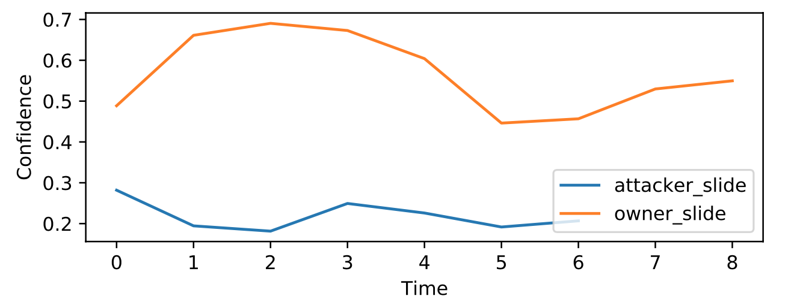

## M2auth: Multimodal Authentication framework on smartphone

[//]: 

**_M2Auth_** is a Multimodal Authentication framework for authenticating smartphone users based on their usage behavior. The design of the framework used a minimal data collection and the feature extraction approaches were conducted on the device while the model generation was performed on the cloud using [GCP](https://cloud.google.com/). The framework collects data of several biometric traits and performs features extraction process on the mobile device to capture discriminative temporal and spatial attributes that distinguishes the legitimate user. The extracted features are gathered and sent to the cloud in order to train a deep learning model to identify the current user of the mobile whether they are legitimate or imposter.

This picture shows the confidence level of both legitimate and attackers. The AI model of the legitimate user has a higher confidence percentage in comparison with the attacker instantly.
